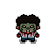
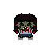
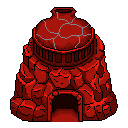
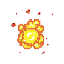
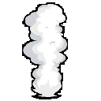

# Zombanga Asset Repository (OS Game Project)

Welcome to the official asset repository for **Zombanga**, an open-source (OS) 2D tower defense game designed to gamify core Operating System concepts. 

Instead of just reading about how a CPU handles processes, players actively step into the role of the OS kernel. To survive, they must allocate limited hardware resources (tower limits), manage a system economy, and strategically deploy defense nodes to process incoming "malware" (zombies).

This repository contains all the original creative assets built for the project, showcasing custom pixel art, character sprites, maps, and animations.

---

## 🛠️ Key Features & OS Integration

The core gameplay mechanics translate actual CPU scheduling algorithms into defensive tower strategies:

* **First-Come, First-Served (FCFS):** Defense nodes attack enemies strictly in the order they enter their range. Simple, but susceptible to the "convoy effect" if a high-health target blocks the queue.
* **Shortest Job First (SJF):** Nodes automatically prioritize and eliminate the lowest-health malware units first to clear the execution queue quickly.
* **Preemptive Priority Scheduling (PPS):** Nodes dynamically shift focus to target the highest-threat enemies (bosses or fast units) the moment they appear, interrupting lower-priority tasks.

---

## 🎨 Art & Visual Aesthetic

Zombanga features a distinct **pixel art aesthetic** that leans into a nostalgic, retro system diagnostic visual style. Every asset in this repository is custom-made to anchor technical computing themes into a tangible, stylized game world.

### Featured Map: Calamba City Plaza
The primary battleground is a custom-designed pixel art map modeled after the real-world **Plaza in Calamba City, Laguna**. This brings a unique, localized flavor to the digital "system environment" players must defend.

---

## 👾 Asset Showcase Gallery

Here is a preview of the custom pixel art and animation assets created entirely within **Aseprite** for this project.

### 🧟 Malware Characters
| Zombie Boy (Front View) | Zombie Girl (Front View) |
| :---: | :---: |
|  |  |
| `BOY-FRONT1.png` | `GIRL-FRONT1.png` |

### 🗼 Defense Towers & Nodes
| Banga Tower | Level 1 Tower (Front) | Level 2 Tower (Front) | Level 3 Tower (Front) |
| :---: | :---: | :---: | :---: |
|  |  |  |  |

### 💥 Combat Effects
| Gun Explosion Frame | Smoke Animation Frame |
| :---: | :---: |
|  |  |

---

## 📂 Repository Contents

This repository serves as the complete archive of my original design work:

* **`ANIMATIONS/`** Full frame-by-frame asset sheets for `EXPLOSION` and `SMOKE` particle sequences.
* **`CHARACTERS/`** Multi-directional (`BACK`, `FRONT`, `SIDE`) sprite sheets for `ZOMBIE-BOY` and `ZOMBIE-GIRL`.
* **`TOWERS/`** Defense structure files covering specialized models like `BANGA` alongside standard upgradable variants (`LVL1` to `LVL3`).
* **`SPLASH-ART/` & `TITLE/`** Production-ready game splash sequences, promotional illustrations, and stylized interface text.

> 💡 *Note: Source `.aseprite` development files are preserved inside their respective directories alongside compiled `.png` asset frames for ease of access.*

---

## 📄 License & Usage

This is an open-source project. All art assets included here are original works created specifically for Zombanga. Please check the `LICENSE` file in this repository for specific terms regarding reuse, modification, and attribution.
